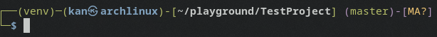

<h1 align="center">Kan`s dotfiles</h1>

<p align="center">
  <a href="https://github.com/TheK4n">
    
  </a>
  <a href="https://github.com/TheK4n/dotfiles">
    
  </a>
</p>


## Content 

* [Project description](#chapter-0)
* [Installation](#chapter-1)


<a id="chapter-0"></a>
## Project description

Config files for:
* bash
* zsh
* alacritty
* tmux
* ssh
* git
* ranger
* i3


### Prompt
<p align="center">
    
</p>

### i3


| Feature                 |                        Shortcut                         |
|:------------------------|:-------------------------------------------------------:|
| Full Screen             |                    <kbd>PrtScr</kbd>                    |
| Selection               |          <kbd>Shift</kbd> + <kbd>PrtScr</kbd>           |
| Active Window           |          <kbd>Super</kbd> + <kbd>PrtScr</kbd>           |
| Clipboard Full Screen   |           <kbd>Ctrl</kbd> + <kbd>PrtScr</kbd>           |
| Clipboard Selection     | <kbd>Ctrl</kbd> + <kbd>Shift</kbd> + <kbd>PrtScr</kbd>  |
| Clipboard Active Window | <kbd>Ctrl</kbd> + <kbd>Super</kbd> + <kbd>PrtScr</kbd>  |


<a id="chapter-1"></a>
## Installation

```bash
git clone https://github.com/TheK4n/dotfiles
cd dotfiles
make
```


<h1 align="center"><a href="#top">▲</a></h1>
